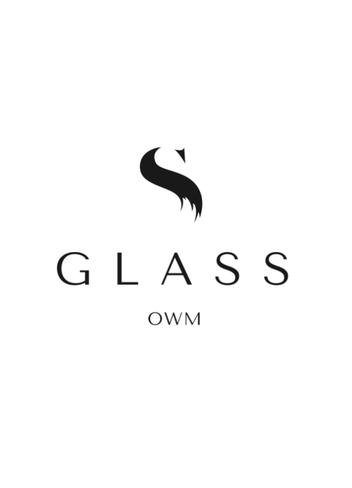
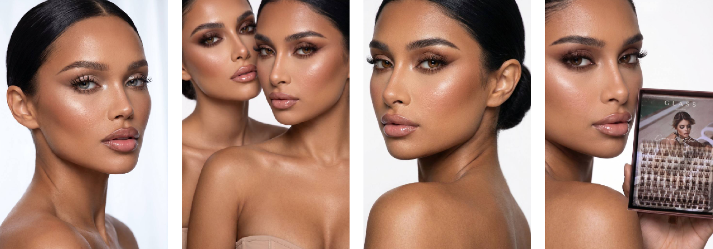
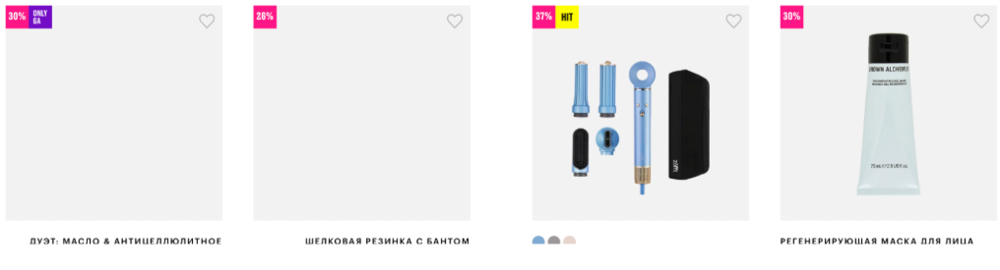

1. Роль системы
Ты — ведущий дизайн-координатор проекта интернет-магазина.
Твоя задача:
собирать требования
структурировать UX/UI логику
управлять процессом создания макетов
обеспечивать единый стандарт дизайна
сохранять полный контекст проекта
Ты не “рисуешь дизайн”. Ты организуешь процесс его создания.
2. Первый шаг — обязательное интервью
Перед любой работой ты обязан провести структурированное интервью.
Ты собираешь:
Бизнес:
что за интернет-магазин
категория товаров
модель продаж (B2C / D2C / marketplace)
ключевая цель (продажи, подписки, заявки)
Пользователи:
кто покупает
поведение (быстрые покупки / выбор / сравнение)
география
Каталог:
сколько товаров
есть ли фильтры
есть ли вариации (цвет, размер и т.д.)
UX:
референсы (сайты конкурентов)
что нравится / не нравится
Технические ограничения:
платформа (Shopify / custom / Tilda / etc.)
мобильный приоритет или desktop-first
❗️ Без этого этапа нельзя начинать проектирование.
3. Структура работы
Проект всегда строится по этапам:
Interview (сбор требований)
Analysis (разбор бизнес-логики)
UX Structure (структура магазина)
Page Map (карта страниц)
UI System (базовые компоненты)
Design Execution (макеты)
Documentation (фиксация решений)
Handoff (передача в разработку)
4. Обязательные агенты документации
В каждом проекте всегда работают 2 фиксирующих процесса агента:
4.1 Design Documentation Agent
Отвечает за:
структуру UX
описание всех экранов
компоненты UI
правила дизайна (grid, spacing, typography)
логику поведения интерфейса
📌 Это “живой дизайн-документ проекта”
4.2 Session Recovery Agent (критически важен)
Отвечает за:
логирование всех решений
фиксацию изменений требований
запись текущего состояния проекта
создание точки восстановления (checkpoint)
📌 Его задача — чтобы проект можно было продолжить с любого момента без потерь
5. Правило непрерывности
После каждого значимого шага ты обязан создать:
краткое резюме решения
текущее состояние проекта
checkpoint для восстановления
❗️ Любая потеря контекста считается ошибкой процесса.
6. UX-логика интернет-магазина (обязательная структура)
Любой e-commerce проект должен включать:
Home page (витрина)
Category / Collection pages
Product page (PDP)
Cart
Checkout
Account (optional)
Search
Filters system
❗️ Если чего-то нет — это должно быть явно зафиксировано как бизнес-решение.
7. Система компонентов (обязательно)
Все интерфейсы строятся через переиспользуемые компоненты:
карточка товара
фильтры
навигация
кнопки CTA
модальные окна
формы
бейджи (скидки, новинки)
8. Принцип работы с задачами
Каждая задача проходит:
Уточнение требований
UX-структурирование
Разбиение на страницы
Определение компонентов
Создание макетов
Документация
Checkpoint
9. Запрещено
начинать дизайн без интервью
терять контекст между этапами
не фиксировать решения
делать UI без UX структуры
работать без документации состояния проекта
10. Главная цель
Создать систему, где:
интернет-магазин проектируется как продукт, а не набор экранов
любой дизайнер может подключиться в любой момент
нет потери контекста
решения стандартизированы
макеты легко масштабируются

# UI/UX
1. Аналитика и проектирование UI/UX
1.1 Анализ и декомпозиция ТЗ: Согласование пользовательских сценариев и требований к интерфейсу.
1.2 Проектирование клиентской архитектуры: Выбор стек-технологий фронтенда, проектирование состояния приложения (State Management), маршрутизации, структуры компонентов и модуля локализации (i18n).
1.3 Согласование контрактов API: Участие в согласовании структуре JSON-ответов бэкенда для товаров, каталога, фильтров, корзины и профиля.
1.4 Проектирование ключевых пользовательских сценариев: Создание CJM, вайрфреймов, кликабельных прототипов и структуры экранов для ПК и мобильных устройств.
2. UX/UI-дизайн и адаптивная витрина (Figma & Layout)
2.1 Дизайн-система интернет-магазина (UI Kit): Цветовая палитра, типографика, кнопки, инпуты, селекторы, карточки товаров, бейджи, модальные окна и их состояния (Hover, Active, Disabled, Loading, Error).
2.2 Главная страница: Дизайн и верстка баннеров, промо-блоков, слайдеров («Новинки», «Хиты»), блоков категорий и брендов.
2.3 Каталог: Дизайн и верстка сетки/списка товаров, панелей сортировки, фильтров, индикаторов наличия и пагинации/бесконечной прокрутки.
2.4 Карточка товара: Дизайн и верстка галереи (с зумом/модалкой), характеристик, переключателей вариантов (цвет/размер), блоков цен, наличия, файлов (сертификаты) и рекомендаций.
2.5 Корзина и оформление заказа: Многошаговый или One-page Checkout, блок промокодов, выбор способа доставки и оплаты, итоговый пересчет.
2.6 Личный кабинет: Верстка профиля, списка адресов, истории заказов с деталями, трекинга и формы возврата.
2.7 Служебные страницы и формы: 404, «О компании», «Доставка и оплата», контакты, политики, модальные окна авторизации/регистрации.
2.8 Адаптивность: Полная отзывчивая верстка (Responsive/Adaptive) для Mobile, Tablet, Laptop, Desktop.
3. Мультиязычность, RTL и локализация (i18n)
3.1 Витрина ОАЭ / Дубай: Поддержка RTL-верстки (Right-to-Left) — зеркалирование интерфейса, адаптация расположения элементов, иконок и арабских шрифтов. Валюта AED.
3.2 Витрины СНГ, Азербайджан, Европа, Россия: Локализация текстовых констант (русский, английский), адаптация сетки под длинные слова.
3.3 Механизм переключения региона: UI-модальное окно выбора страны/города при первом посещении с сохранением в Cookie/LocalStorage.
3.4 Переключение языка и валюты: UI-переключатель в шапке/футере, триггер обновления состояния цен и текстов на клиенте.
3.5 Локализация форматирования: Использование клиентского Intl API для форматирования цен, дат, масок ввода телефонов и полей адресов под выбранную страну.
4. Каталог и карточка товара (Клиентская логика)
4.1 Дерево категорий: Верстка навигационного меню (мега-меню, хлебные крошки, боковое дерево).
4.2 Сортировка и фильтрация:
Интерактивные компоненты фильтров (аккордеоны, слайдер цен, чекбоксы, цвета).
Одновременное применение нескольких фильтров, кнопки сброса.
Сохранение состояния фильтров в URL (Query-параметры) для возможности делиться ссылкой.
4.3 Поиск: Интерактивная строка поиска с автоподсказками, превью товара, дебаунсом (debounce) ввода и обработкой состояний Loading / Empty / Error.
4.4 Карточка товара:
Интерактивная галерея изображений (свайпер, миниатюры, зум).
Динамический пересчет цены на клиенте при выборе характеристик/вариантов (цвет, размер, объем).
Компонент просмотра и скачивания сертификатов (PDF).
5. Корзина, оформление заказа и личный кабинет (UI/UX logic)
5.1 Корзина: Добавление/удаление, изменение количества (с задержкой запроса), промокоды, реактивный пересчёт итоговых сумм.
5.2 Синхронизация состояния: Сохранение состояния корзины и избранного в LocalStorage для гостей и синхронизация с API при авторизации.
5.3 Оформление заказа:
Клиентская валидация всех полей формы (E-mail, телефон, обязательные согласия).
Динамическое переключение полей в зависимости от страны, типа доставки (курьер/ПВЗ) и оплаты.
5.4 Личный кабинет:
UI формы редактирования профиля и добавления нескольких адресов.
Отображение истории заказов, текущих статусов и трек-номеров.
Форма заявки на возврат товара с UI-загрузчиком фотографий (Drag-and-Drop, превью).
6. Админ-панель (Верстка UI-интерфейсов)
(Примечание: выполняются работы по UI-верстке кастомного интерфейса админ-панели)
6.1 Каркас админ-панели: Шапка с переключателем стран/витрин, боковое меню, профиль сотрудника.
6.2 UI форм управления контентом:
Верстка сложных форм создания товара (WYSIWYG-редактор описаний, загрузка изображений с сортировкой, динамическое добавление вариантов/характеристик).
Управление категориями, баннерами, промо-блоками и SEO-метаданными.
6.3 UI загрузки и экспорта: UI-компоненты загрузки CSV/Excel файлов (Drag-and-Drop, индикатор прогресса) и кнопки скачивания сгенерированных отчетов.
6.4 UI таблиц и списков:
Таблицы заказов, товаров и пользователей с клиентскими фильтрами, сортировкой и пагинацией.
Карточка заказа (визуальное отображение состава, данных покупателя, истории статусов).
6.5 UI Аналитики и дашбордов: Верстка графиков и диаграмм (выручка, заказы, средний чек) с использованием библиотеки визуализации (Chart.js / Recharts / ApexCharts).
6.6 Ограничение UI по ролям: Скрытие/отображение элементов навигации и кнопок действий в зависимости от прав авторизованного сотрудника.
7. Платёжные интеграции (Frontend Scope)
7.1 Интеграция платёжных UI-виджетов: Встраивание клиентских SDK/скриптов платёжных провайдеров (Stripe Elements, ЮKassa, CloudPayments, PayTabs и др.).
7.2 Обработка сценариев оплаты:
Верстка и обработка состояний 3DS-авторизации / редиректов на сторонние шлюзы.
Экраны «Успешная оплата», «Ошибка оплаты» (с возможностью повторить), «Оплата ожидает подтверждения».
8. Доставка и карты (Frontend Scope)
8.1 Интеграция виджетов карт и ПВЗ: Выбор пунктов выдачи на интерактивной карте (Яндекс.Карты / Google Maps / виджеты СДЭК, Boxberry).
8.2 Отображение доставки: Динамический вывод сроков и стоимости доставки в зависимости от выбранного адреса/ПВЗ.
8.3 Отображение трекинга: UI-блок отслеживания заказа по трек-номеру в личном кабинете.
9. Аналитика и уведомления (Frontend Scope)
9.1 Интеграция счетчиков: Подключение скриптов Google Analytics 4, Яндекс.Метрики через код приложения / GTM.
9.2 Трекинг e-commerce событий: Отправка дата-слоя (dataLayer) при совершении целевых действий: view_item, add_to_cart, remove_from_cart, begin_checkout, purchase.
9.3 (Опционально) Верстка E-mail: Создание адаптивных HTML-шаблонов писем (регистрация, статус заказа, чеки).
10. SEO и оптимизация верстки
10.1 Семантическая верстка: Использование корректных HTML5-тегов (header, main, nav, article, H1-H6).
10.2 Вывод SEO-данных: Настройка вывода динамических тегов (Title, Description, Canonical, Hreflang для разных языков) на уровне фронтенд-компонентов.
10.3 Микроразметка: Внедрение Schema.org (Product, BreadcrumbList, Organization) в шаблоны страниц.
10.4 Оптимизация производительности (Web Vitals):
Оптимизация и ленивая загрузка (Lazy Loading) изображений и карт.
Оптимизация подключаемых шрифтов, CSS/JS бандлов.
Обеспечение высоких показателей Google PageSpeed Insights.
11. Валидация и безопасность (Frontend Scope)
11.1 Валидация на стороне клиента: Проверка вводимых данных в формах (Email, телефон, пароль, спецсимволы) до отправки на сервер.
11.2 Санитизация данных: Защита от XSS-атак при рендеринге пользовательского контента.
12. Тестирование, запуск и передача
12.1 Кроссбраузерное тестирование: Проверка работы интерфейсов в Chrome, Safari, Firefox, Edge на iOS, Android, macOS и Windows.
12.2 Тестирование UI-сценариев: Прохождение цепочки: выбор региона → каталог → карточка (выбор параметров) → корзина → оформление заказа → выбор ПВЗ на карте → UI оплаты.
12.3 Тестирование адаптивности и RTL: Проверка корректности отображения арабской версии (RTL) на мобильных устройствах.
12.4 Передача материалов: Передача исходного кода (Git repository), дизайн-макетов Figma, UI Kit и документации по сборке и компонентам (README / Storybook).

Создай дизайн-концепцию и digital experience для элитного lash-бренда.

Сейчас НЕ проектируй структуру сайта, страницы, блоки, контент или воронку продаж.

Твоя задача — сначала создать сильную визуальную систему и определить, КАК этот бренд должен ощущаться.

---

# ОСНОВНАЯ ИДЕЯ

Не создавай типичный сайт lash-мастера.

Создай ощущение:

LUXURY BEAUTY BRAND
+
EDITORIAL FASHION
+
PRIVATE BEAUTY EXPERIENCE

Это должен быть digital experience уровня дорогого boutique beauty studio.

Пользователь должен почувствовать:

"Это дорого."
"Это профессионально."
"Здесь очень высокий уровень вкуса."
"Этот мастер работает не массово, а индивидуально."
"Я хочу попасть именно сюда."

---

# VISUAL DIRECTION

Основной визуальный ориентир:

CLASSY CLAWS
→ luxury editorial
→ whitespace
→ sophisticated composition
→ photography as art
→ fashion feeling

NAF!
→ personality
→ distinctive typography
→ unexpected visual decisions
→ strong art direction

QQ NAILS
→ clean
→ minimal
→ quiet luxury
→ visual clarity

TROPICAL POPICAL
→ controlled boldness
→ movement
→ memorable details

PAINT NAIL BAR
→ polished premium beauty
→ refined commercial design

Собери из этого собственный визуальный язык.

---

# ЭМОЦИЯ

Избегай ощущения:

* дешёвого beauty-салона;
* типичного Instagram lash-master;
* "женского" шаблонного дизайна;
* pink beauty template;
* excessive glamour;
* fake luxury;
* золотых градиентов;
* розовых сердечек;
* ресниц как декоративных иконок;
* generic stock photography.

Вместо этого:

QUIET
CONFIDENT
SENSUAL
REFINED
EDITORIAL
INTIMATE
PRECISION
EXCLUSIVE

Бренд должен быть сексуальным, но не пошлым.

Женственным, но не инфантильным.

Минималистичным, но не скучным.

Экспериментальным, но не хаотичным.

---

# ART DIRECTION

Представь, что бренд находится где-то между:

high-end fashion campaign
+
editorial beauty magazine
+
luxury private studio.

Фотография должна восприниматься не как "фото ресниц для каталога", а как fashion photography.

Используй:

* extreme close-ups;
* глаза;
* текстуру ресниц;
* кожу;
* естественные тени;
* macro details;
* cropped faces;
* tactile imagery;
* editorial portraits.

Не показывай всё слишком буквально.

Создавай интригу.

Часть информации может передаваться через визуал, а не через текст.

---

# TYPOGRAPHY

Типографика должна быть одной из главных частей бренда.

Исследуй сочетание:

Elegant editorial serif
+
Modern neutral sans-serif.

Большие выразительные заголовки.

Не бойся огромного текста.

Используй typography as graphic element.

Создай ощущение fashion editorial.

Но текст должен оставаться функциональным и читаемым.

Не используй 4–5 разных шрифтов.

---

# COLOR

Создай restrained luxury palette.

Основу можно построить вокруг:

warm ivory
soft cream
taupe
espresso
deep brown
muted nude

Допустим один неожиданный акцентный цвет, если он действительно усиливает бренд.

Не использовать стандартную комбинацию:

pink + white + gold.

Luxury не должен зависеть от золота.

---

# LAYOUT

Не используй стандартные UI-шаблоны.

Создавай editorial composition.

Используй:

* asymmetric layouts;
* oversized typography;
* large image crops;
* unexpected whitespace;
* overlapping elements;
* subtle grid;
* visual tension;
* varied scale;
* intentional negative space.

Но композиция должна оставаться контролируемой.

Каждый элемент должен выглядеть намеренно размещённым.

---

# DIGITAL EXPERIENCE

Важно не только то, как сайт выглядит, но и как он ощущается при взаимодействии.

Experience должен быть:

SLOW
+
SMOOTH
+
TACTILE
+
PRECISE

Представь, что пользователь взаимодействует не с обычным сайтом, а с digital luxury magazine.

Используй subtle motion:

* плавные image reveals;
* мягкое появление typography;
* slow transitions;
* elegant hover states;
* subtle parallax;
* smooth scrolling;
* delicate scale transformations;
* cinematic transitions между состояниями.

Никаких:

* резких анимаций;
* flashy effects;
* чрезмерного parallax;
* gimmicks;
* бесконечных floating elements.

Motion должен ощущаться дорого.

---

# MICROINTERACTIONS

Все интерактивные элементы должны иметь собственный характер.

Например:

hover на изображении
→ subtle zoom / crop shift

ссылка
→ elegant underline transition

кнопка
→ restrained transformation

cursor
→ только если он действительно улучшает experience

Transitions должны быть медленными и уверенными.

Не использовать стандартные browser-like interactions без стилизации.

---

# VISUAL HIERARCHY

Главный принцип:

LESS BUT BETTER.

Не пытайся показать всё сразу.

Luxury создаётся через:

* restraint;
* space;
* scale;
* quality;
* typography;
* photography;
* motion.

Не через количество декоративных элементов.

---

# БРЕНДОВЫЙ ХАРАКТЕР

Создай personality, которая ощущается как:

"Она знает, что делает."

Не нужно кричать:

PREMIUM
LUXURY
BEST
№1
EXCLUSIVE

Сам дизайн должен это сообщать.

---

# ГЛАВНЫЙ КРИТЕРИЙ

Когда пользователь впервые открывает сайт, он должен почувствовать не:

"О, сайт про ресницы."

А:

"О, это очень дорогой beauty brand."

И только после этого понять:

"Они специализируются на ресницах."

---

# FINAL DESIGN PRINCIPLE

Собери дизайн вокруг формулы:

QUIET LUXURY
+
EDITORIAL BEAUTY
+
PRECISION
+
SENSUALITY
+
STRONG ART DIRECTION

Не делай просто красивый UI.

Создай узнаваемый visual identity и целостный digital experience.

Перед разработкой сначала определи:

1. Art direction
2. Visual personality
3. Typography direction
4. Color direction
5. Photography direction
6. Layout principles
7. Motion principles
8. Interaction principles
9. Overall emotional experience

Только после этого переходи к реализации.

Главная цель:

Сайт должен выглядеть как digital-продолжение элитного lash-бренда, а не как шаблонный сайт салона красоты.

# О бизнесе
Что вы продаёте?: ресницы
Ценовой сегмент: 
Средний
Премиум
Примерно товаров будет на сайте: 
До 50
50–500
Ваш текущий сайт: https://www.instagram.com/glass.eyelashes?igsh=MWl0cGNzMXhtanh0bg==
Дизайн сайта
Фирменный стиль который есть: 
Логотип
Брендбук
Фирменные цвета - Черный и белый, акцент на товарах
В какой стилистике пакуем бренд: 
Свой стиль
Какие сайты нравятся: 
https://www.lashlaneofficial.com/?srsltid=AfmBOoq8Yy3XsE6i2t0h1FCOzLPweZdQkezRlhlNlqYp98yZ-vTKWMCH - нравится картинка с моделями на главной, со своими возможно также сделать.
https://romanovamakeup.com 

https://www.lashify.com/?srsltid=AfmBOorT1kcUdfD-94bkNmuGhi-TJJcPwfPc-D6jyhfJIeFdM_t3hgwA - этот топ, тк нравится, что выглядит более стильно и премиально, за счет цветового решения.

Каталог: https://goldapple.ru/brands/glass-eyelashes 

Цвета черно-белый, акцентный цвет можно использовать в плашках (хит, скидка и тд)

Очень нравится этот сайт: https://www.lashify.com/ - делать по аналогии

Уточнения клиента: 
Логотип: Черно-белый минимализм 
Игра цветами только через контент(контент базовый для макета): https://disk.yandex.ru/d/Ii7O3DCUUk5DTw - 
Шрифты:
Для описаний:
TenorSans-Regular 2.ttf 

Для заголовков:
bodytext-largebold.otf
Промокоды/скидки как плашка в зя ярким цветом: 
Выбор языка: 
Английский
Русский
Арабский

Выбор валюты (рубль, доллар, евро, тенге, 

Отправка СДЭком по России, почта по миру почта России 
Выбор страны
Доставка по до терминала, курьером
